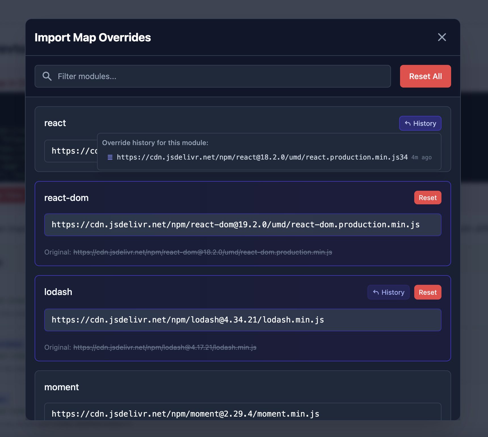

# Import Map Devtools

A modern UI for overriding import maps in the browser, built with React, Tailwind CSS, and Shadcn UI.

## About

Import Map Devtools is a modern UI for the [import-map-overrides](https://github.com/single-spa/import-map-overrides) concept, focusing on providing a beautiful, user-friendly interface for developers to override import maps during development.

Import maps are a web standard that allow you to control how the browser resolves JavaScript module specifiers. The Import Map Devtools library makes it easy to override these mappings, helping you develop and debug microfrontend applications without needing to set up complex local environments.



## Features

- 🎨 Modern UI built with React and Tailwind CSS
- 💾 Persists overrides in localStorage for convenience
- 🔍 Filter and search through modules
- 📋 Edit module URLs with a convenient dialog
- 🔄 Reset individual or all overrides
- 📱 Responsive design that works on all devices
- ⚡️ Loader script to ensure overrides are applied before import maps are processed

## Usage

### Installation

For import map overrides to work correctly, you **must** include the loader script **before** any import maps in your HTML:

```html
<!-- Import Map Devtools Loader - include BEFORE import maps -->
<script src="https://cdn.jsdelivr.net/gh/[your-github-username]/import-map-devtools@latest/packages/import-map-devtools/dist/loader.global.js"></script>

<!-- Your import maps come after the loader -->
<script type="importmap">
  {
    "imports": {
      "react": "https://cdn.example.com/react.js"
    }
  }
</script>
```

You can also pin a specific version:

```html
<script src="https://cdn.jsdelivr.net/gh/[your-github-username]/import-map-devtools@v1.0.0/packages/import-map-devtools/dist/loader.global.js"></script>
```

This is crucial because browsers process import maps immediately when they're encountered. The loader script ensures your overrides are applied before the browser processes the import maps.

### UI Component

Add the `ImportMapDevtools` component to your application:

```jsx
import { ImportMapDevtools } from "import-map-devtools";

function App() {
  return (
    <div>
      {/* Your app content */}
      <ImportMapDevtools />
    </div>
  );
}
```

### Styles

The library includes its own bundled styles. You can import them in your application:

```jsx
import "import-map-devtools/dist/styles.css";
```

Or if you're using a bundler that supports CSS imports, you can import them directly:

```jsx
import "import-map-devtools";
```

The styles are automatically included when you import the component.

### Configuration Options

The `ImportMapDevtools` component accepts the following props:

```jsx
<ImportMapDevtools
  buttonPosition="bottom-right" // "top-left", "top-right", "bottom-left", "bottom-right"
  buttonText="Import Map" // Custom button text
  className="" // Additional CSS classes for the button
/>
```

## Development

This project uses a monorepo structure:

- `packages/import-map-devtools`: The core library
- `packages/example`: An example app to demonstrate functionality

### Setup

```bash
# Start the example app
npm run dev

# Build the library
npm run build
```

## Deployment

### Example App

The example app is automatically deployed to GitHub Pages when changes are pushed to the main branch. You can also manually trigger the deployment workflow from the GitHub Actions tab.

To view the deployed example app, visit: [Import Map Devtools Demo](https://[your-github-username].github.io/import-map-devtools/)

### Package Publication

The library is published to GitHub Packages, making it available via jsDelivr. New versions are published through our unified release workflow that supports multiple triggering methods:

#### Automatic Versioning with PR Labels

When merging a Pull Request to the main branch, you can add one of the following labels to automatically trigger a version bump and package release:

- `version:patch` - For backwards-compatible bug fixes (1.0.0 → 1.0.1)
- `version:minor` - For new backwards-compatible functionality (1.0.0 → 1.1.0)
- `version:major` - For breaking changes (1.0.0 → 2.0.0)

#### Direct Commits to Main

Any direct commits pushed to the main branch will automatically trigger a patch version update (e.g., 1.0.0 → 1.0.1) and publish a new release.

#### Manual Release

You can also manually trigger a release:

1. Go to the "Actions" tab in the GitHub repository
2. Select the "Release and Publish" workflow
3. Click "Run workflow"
4. Select the version type (`patch`, `minor`, `major`) or enter a specific version number

For all release methods, the workflow will:

1. Update the version in both package.json files using npm's versioning system
2. Create a Git tag and GitHub Release
3. Publish the package to GitHub Packages

After publishing, the loader script will be available at:

```
https://cdn.jsdelivr.net/gh/[your-github-username]/import-map-devtools@latest/packages/import-map-devtools/dist/loader.global.js
```

## License

MIT
